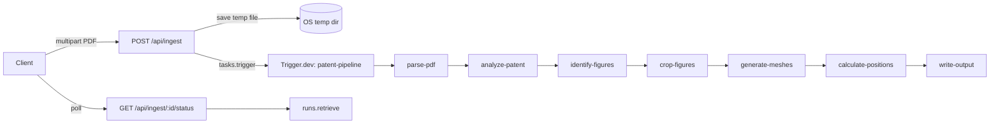

# Patent PDF → 3D Model Pipeline

This document describes how the patent PDF ingestion pipeline is wired: HTTP entry points, Trigger.dev orchestration, per-step tasks, external services, and how it relates to the product plan and brainstorm.

**Related docs**

- [Brainstorm (2026-03-22)](brainstorms/2026-03-22-patent-pdf-to-3d-pipeline-brainstorm.md) — goals, tradeoffs, and open questions
- [Feature plan (2026-03-22)](plans/2026-03-22-feat-patent-pdf-to-3d-pipeline-plan.md) — phased implementation, file layout, acceptance criteria

---

## Purpose

The pipeline takes a **patent PDF**, extracts text and page images, uses **multimodal LLMs** (via OpenRouter) for metadata and figure analysis, generates **real `.glb` meshes** with **fal.ai Trellis** from cropped figures, computes **assembled / exploded positions**, and (when the final write step is implemented) **persists** invention data and assets so new items can appear in Inventra alongside curated content.

Processing is **asynchronous**: the API returns immediately with a run identifier; clients poll for completion.

---

## End-to-end flow

---

## HTTP API

### `POST /api/ingest`

- **Body:** `multipart/form-data` with field `pdf` (the file).
- **Validation:** PDF MIME type (`application/pdf`), max size **20 MB**.
- **Behavior:** Writes the upload to the system temp directory (`os.tmpdir()`), then triggers the Trigger.dev task `patent-pipeline` with `{ pdfPath, jobId }`.
- **Response (JSON):** `jobId` (string label like `job-<timestamp>`), `runId` (Trigger.dev run id), `status: "queued"`.

`jobId` in the response is **not** the same as the Trigger run id used by the status route (see below).

### `GET /api/ingest/[jobId]/status`

- **Behavior:** Calls `runs.retrieve(jobId)` from `@trigger.dev/sdk/v3` with the path segment as the run identifier.
- **Response (JSON):** `status`, `isCompleted`, `isSuccess`, `isFailed`, `output` (pipeline result when successful), `createdAt`, `updatedAt`.

**Important:** The route parameter is named `jobId`, but the implementation uses it as the **Trigger.dev run id**. Clients should poll using the **`runId`** returned from `POST /api/ingest`, not the human-readable `jobId` string, unless the API is later updated to map between them.

---

## Trigger.dev configuration

- **Config file:** `trigger.config.ts` at the repo root.
- **Task directory:** `./trigger`.
- **Max duration:** 600 seconds (10 minutes) per task.
- **Build:** `@napi-rs/canvas` and `pdfjs-dist` are marked **external** so they bundle correctly on Trigger’s workers.

---

## Orchestrator: `patent-pipeline`

**File:** `trigger/patent-pipeline.ts`

The orchestrator task `patent-pipeline` runs seven subtasks **in sequence** using `triggerAndWait().unwrap()`:

1. **`parse-pdf`** — PDF → per-page PNG + text  
2. **`analyze-patent`** — structured metadata (title, year, inventors, etc.)  
3. **`identify-figures`** — which figures are 3D-convertible + bounding boxes + component hints  
4. **`crop-figures`** — crop page images and upload PNGs to fal storage  
5. **`generate-meshes`** — Trellis image → `.glb` per figure  
6. **`calculate-positions`** — assembled / exploded positions from spatial hints  
7. **`write-output`** — persist `.glb` files and generated TypeScript data (see [Write output](#write-output))

The parent task returns `{ inventionId, title, componentCount }` after a successful run.

---

## Step-by-step tasks

### 1. Parse PDF (`parse-pdf`)

**File:** `trigger/tasks/parse-pdf.ts`

- Reads the PDF from disk into a buffer.
- **`pdfjs-dist`** (`legacy/build/pdf.mjs`): loads the document, iterates every page.
- **Text:** `page.getTextContent()` → concatenated strings.
- **Image:** Renders each page with **`@napi-rs/canvas`** at scale `2.0`, exports **PNG**, encodes as **base64** for downstream multimodal calls.

**Output:** `{ pages: [{ pageNumber, imageBase64, text }], totalPages }`.

---

### 2. Analyze patent (`analyze-patent`)

**File:** `trigger/tasks/analyze-patent.ts`

- Concatenates page text (truncated for the prompt) and sends **up to the first 4 pages** as images.
- Uses **`structuredOutput`** from `src/lib/openrouter.ts` with a **JSON schema** matching `PatentAnalysis` (title, year, inventors, description, `category` as a fixed enum, country, `countryCode`, patent number, `location`).
- **Model:** `google/gemini-2.0-flash-001` (via OpenRouter).
- **Post-processing:** Invalid category → `"other"`; suspicious year → clamped to `2000`.
- **`id`:** URL-safe slug derived from the patent number (lowercase, non-alphanumerics → `-`).

**Requires:** `OPENROUTER_API_KEY` (structured output throws if missing).

---

### 3. Identify figures (`identify-figures`)

**File:** `trigger/tasks/identify-figures.ts`

- Sends **up to 8 page images** to the multimodal model with a patent-figure expert system prompt.
- Asks for **3D-representable** figures (exploded views, perspective parts, etc.) and excludes flowcharts, circuits, graphs, etc.
- Returns **percentage bounding boxes** `{ x, y, width, height }` on the page, plus `componentName`, `description`, `materials`, `color` (hex), `patentText`, and **`spatialHint`** (`top` | `bottom` | `left` | `right` | `center` | `front` | `back`).
- **Hard cap:** at most **6** figures after the model response.

---

### 4. Crop figures (`crop-figures`)

**File:** `trigger/tasks/crop-figures.ts`

- For each figure, finds the matching page by `pageNumber`.
- Decodes the page PNG, **`@napi-rs/canvas`** `loadImage` + `drawImage` to crop the percentage box; minimum crop size **256×256**; white background fill.
- Uploads each crop with **`fal.storage.upload`** (`@fal-ai/client`) and collects **public image URLs** for Trellis.

---

### 5. Generate meshes (`generate-meshes`)

**File:** `trigger/tasks/generate-meshes.ts`

- For each cropped image URL, calls **`fal.subscribe("fal-ai/trellis", { input: { image_url } })`** with polling.
- Reads **`result.data.model_mesh.url`**, downloads the `.glb`, stores **base64** in the task output alongside the remote URL.
- Per-mesh failures are logged; if **no** mesh succeeds, the task **throws**.

**Note:** The written plan references `fal-ai/trellis-2` and different response field names; the implementation uses `fal-ai/trellis` and `model_mesh.url`. Align the plan or code when stabilizing.

---

### 6. Calculate positions (`calculate-positions`)

**File:** `trigger/tasks/calculate-positions.ts`

- Maps each figure’s **`spatialHint`** to a fixed offset vector, then derives:
  - **Assembled** position: small offsets from the hint (scaled by `0.5`).
  - **Exploded** position: radial spread using index and hint, with a fixed radius (`2.5`).
- Aligns count with `min(figures.length, meshCount)` so mesh and figure lists stay consistent.
- Returns fixed **camera** position/target `[0, 1.5, 5]` and `[0, 0, 0]` (the plan describes tighter coupling to bounding spheres later).

---

### Write output (`write-output`)

**Planned file:** `trigger/tasks/write-output.ts` (referenced by `patent-pipeline.ts`; implementation may still be in progress)

Per [the feature plan](plans/2026-03-22-feat-patent-pdf-to-3d-pipeline-plan.md), this step should:

1. Write `.glb` files under `public/models/<invention-id>/`.
2. Append or merge entries into generated TypeScript modules under `src/data/generated/` (e.g. `inventions-generated.ts`, `components-generated.ts`, `models-generated.ts`).
3. Keep hand-authored `src/data/*.ts` files importing and merging generated exports.

Until this step exists and the data layer merges generated entries, the pipeline cannot complete end-to-end in the app UI without manual steps.

---

## Shared libraries

### OpenRouter (`src/lib/openrouter.ts`)

- **`structuredOutput`:** Chat Completions API with `response_format: json_schema` (strict) for structured patent/figure outputs.
- **`multimodalMessage`:** Builds user messages with `data:image/png;base64,...` image parts for vision models.

Pipeline tasks **do not** use the app’s offline chat fallbacks; they require a real API key for structured analysis.

---

## Environment & secrets

| Variable | Role |
|----------|------|
| `OPENROUTER_API_KEY` | Required for `analyze-patent` and `identify-figures` |
| `FAL_KEY` (or fal client env per fal docs) | fal.ai storage upload + Trellis |
| Trigger.dev project credentials | Configured for `tasks.trigger` / `runs.retrieve` (see Trigger.dev docs) |

---

## Operational constraints (from brainstorm / plan)

- **Filesystem writes** to `public/` and `src/data/` **work locally or on a self-hosted** Node host; **read-only** serverless deploys (e.g. Vercel) cannot persist generated files without object storage or a different persistence layer.
- **Cost:** Up to **6** Trellis calls per patent plus multiple LLM calls; figure identification and cropping are bounded by page/image limits in code.
- **Quality:** Some patent figures (cross-sections, schematics) may produce poor meshes; the generator skips failed meshes but requires at least one success.

---

## Summary

| Stage | Technology | Output |
|-------|------------|--------|
| Upload | Next.js `POST /api/ingest` | Temp PDF path + Trigger run |
| Parse | pdfjs-dist + napi-rs canvas | Page images + text |
| Metadata | OpenRouter + JSON schema | `PatentAnalysis` + `id` |
| Figures | OpenRouter vision + JSON schema | ≤6 figures with boxes |
| Crop | Canvas + fal storage | `image/png` URLs |
| 3D | fal.ai Trellis | `.glb` (base64 + URL) |
| Layout | Heuristic from `spatialHint` | Positions + camera |
| Persist | `write-output` (planned) | `public/models/` + generated TS |

For product vision and roadmap detail, use the [brainstorm](brainstorms/2026-03-22-patent-pdf-to-3d-pipeline-brainstorm.md) and [plan](plans/2026-03-22-feat-patent-pdf-to-3d-pipeline-plan.md) alongside this file.
