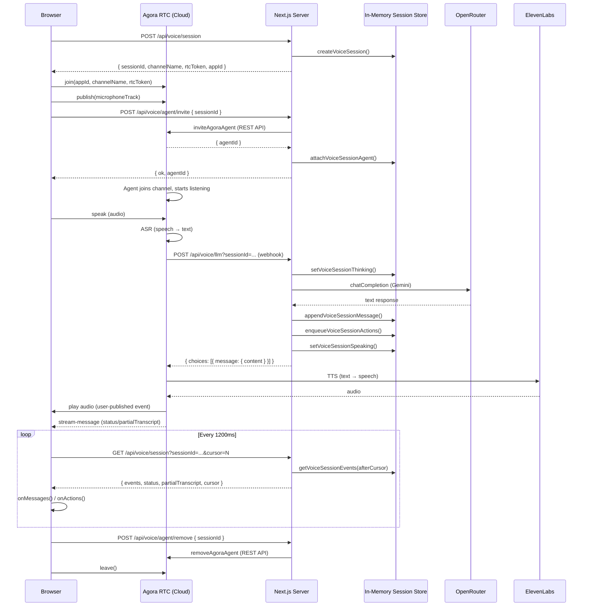

# Voice Architecture

## Current Setup



## Why Polling Exists

The Agora agent runs in **Agora's cloud**. When the LLM webhook fires, your server writes
messages and actions into the in-memory session store. The browser has no persistent
connection to receive these updates, so it polls every 1200ms.

Agora's `stream-message` RTC events only carry lightweight status/transcript signals —
not full chat messages or `ExpertAction` payloads.

## The Vercel Problem

On Vercel (serverless), each request is a separate function invocation and may land on a
different instance. The in-memory `SessionStore` is not shared across instances, which means:

- The LLM webhook and the polling endpoint could hit **different processes** with no
  shared state
- SSE with a subscriber map won't work without a shared pub/sub layer (e.g. Redis, Pusher)

## Options to Replace Polling

| Option | How | Works on Vercel? |
|--------|-----|-----------------|
| **SSE + Redis/Pusher** | Webhook publishes event; browser receives via SSE backed by pub/sub | Yes |
| **Agora stream-message** | Webhook calls Agora REST API to send data message over RTC channel | Yes |
| **Keep polling** | Move session store to Vercel KV (Redis) | Yes |
```
